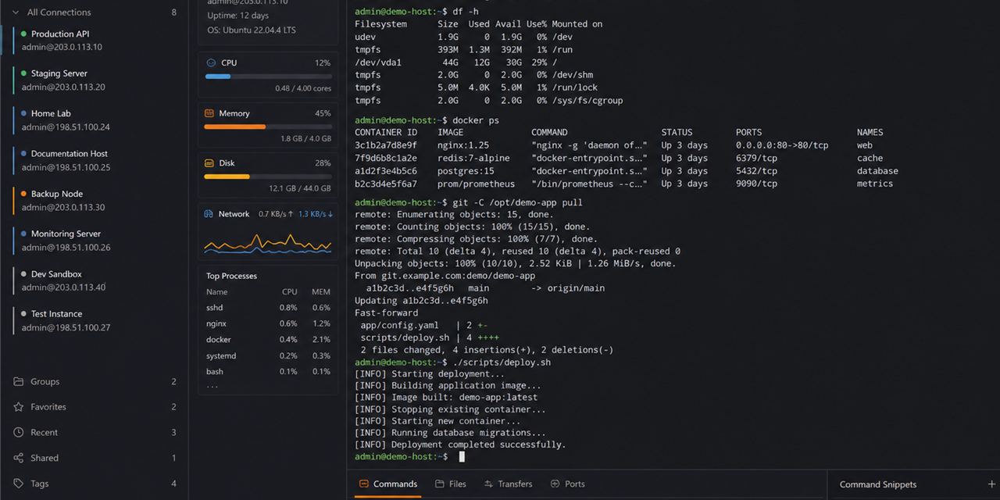

# Nutshell

[](https://github.com/amoiwu-aa/nutshell/actions/workflows/ci.yml)
[](LICENSE)



**Nutshell** is an open-source desktop SSH remote management tool built with Electron, React, TypeScript, and Rust. It brings terminal access, SFTP, server monitoring, Docker operations, port forwarding, and a remote workspace into one focused application.

> **Status:** Active development. The repository is public and welcomes issue reports, feedback, and focused contributions.

[Download the latest release](https://github.com/amoiwu-aa/nutshell/releases) · [Report a bug](https://github.com/amoiwu-aa/nutshell/issues/new/choose) · [Request a feature](https://github.com/amoiwu-aa/nutshell/issues/new/choose)

## Why Nutshell?

Remote server work often requires switching between a terminal, an SFTP client, a monitoring dashboard, Docker tools, and a code editor. Nutshell combines these workflows while keeping the Electron process boundary explicit and treating remote data as untrusted input.

### Features

- **SSH terminal** — xterm.js terminal with multi-tab sessions, 256-color/true-color support, Unicode handling, search, links, and renderer tuning for heavy interactive CLIs.
- **SFTP file management** — local/remote browsing, uploads, downloads, resumable transfers, recursive operations, and in-app editing.
- **Server monitoring** — CPU, memory, swap, disk, network, process, and listening-port views with real-time updates.
- **Docker management** — containers, images, logs, networks, Compose projects, and container terminals.
- **Port forwarding** — local, remote, and dynamic SOCKS5 forwarding with a visual rule manager.
- **Remote workspace** — remote file tree, search, Git status/diff, Monaco Editor, diagnostics, and project summaries.
- **Command snippets** — reusable commands, variables, batch execution, and import/export.
- **SSH security** — password/key authentication, jump-host support, and trust-on-first-use host-key verification.
- **Dual engine** — Node.js `ssh2` for the primary desktop integration and a Rust `russh`/`russh-sftp` sidecar for native remote filesystem and transfer operations.

## Security model

Security is treated as a product requirement rather than an optional feature:

- Renderer code accesses the main process only through the typed preload bridge.
- Context isolation is enabled and Node integration is disabled.
- Saved connection credentials are encrypted locally by the configuration store.
- SSH host keys are checked against a local known-hosts store and changed keys stop the connection.
- Application-managed remote arguments are validated and shell-quoted before execution.
- SFTP APIs are preferred over shelling out for file operations.
- External links are restricted to `http://` and `https://` before being handed to the operating system.

Please read [SECURITY.md](SECURITY.md) before reporting a vulnerability.

## Technology

| Area | Technology |
| --- | --- |
| Desktop shell | Electron 33 |
| UI | React 19, TypeScript, Tailwind CSS |
| Build | Vite, electron-vite, electron-builder |
| Terminal | xterm.js |
| Editor | Monaco Editor |
| SSH | Node.js `ssh2` + Rust `russh`/`russh-sftp` |
| Charts | Recharts |
| State | Zustand |
| Storage | electron-store with encrypted credentials |

## Quick start

### Requirements

- Node.js 22+
- npm
- Rust toolchain and Cargo for the native sidecar
- A local SSH-accessible server for manual testing

### Install and run

```bash
npm install
npm run dev
```

### Quality checks

```bash
npm run typecheck
npm run lint
npm test
cargo check --manifest-path native/nutshell-core/Cargo.toml
```

### Build the Rust sidecar

```bash
npm run native:build
```

The packaging commands build the current platform's sidecar automatically:

```bash
npm run build:win
npm run build:mac
npm run build:linux
```

## Architecture

Nutshell follows the standard Electron three-process model:

```text
Renderer (React)
    │ typed window.api bridge
Preload (contextBridge)
    │ IPC request/response + streamed events
Main process (Node.js)
    ├── SSH/SFTP/Docker/monitor/workspace services
    ├── encrypted configuration store
    └── Rust sidecar supervisor
             │ JSON-RPC over framed stdio
       Rust nutshell-core (russh/russh-sftp)
```

More detail is available in [docs/architecture.md](docs/architecture.md).

## Project structure

```text
native/nutshell-core/       Rust sidecar
src/main/                   Electron main process and services
src/preload/                Secure renderer-to-main bridge
src/renderer/src/           React application
src/main/ipc/               Feature-specific IPC handlers
tests/                      Unit and manual integration test helpers
scripts/                    Build and development scripts
```

## Roadmap

- Expand automated SSH/SFTP/Rust integration coverage.
- Improve cross-platform release artifacts and signing documentation.
- Add richer connection organization and transfer history.
- Continue reducing renderer bundle cost and improving terminal lifecycle stability.
- Evaluate OS-backed credential storage for supported platforms.

See [CONTRIBUTING.md](CONTRIBUTING.md) for development conventions and [CHANGELOG.md](CHANGELOG.md) for notable changes.

## Contributing

Bug reports, reproducible diagnostics, documentation improvements, and focused pull requests are welcome. Please include the platform, Node/Rust versions, reproduction steps, and sanitized logs when reporting a problem.

## 中文简介

Nutshell 是一个开源桌面 SSH 远程管理工具，使用 Electron、React、TypeScript 和 Rust 构建，集成 SSH 终端、SFTP、服务器监控、Docker、端口转发和远程工作区。

项目重点包括：

- 多标签 SSH 终端
- 本地/远程双栏文件管理与断点传输
- CPU、内存、磁盘、网络和进程监控
- Docker 容器、镜像、日志和 Compose 管理
- 本地、远程、动态 SOCKS5 端口转发
- Monaco 远程编辑器、全文搜索和 Git diff
- 主机密钥校验与本地加密凭据存储
- Node.js 与 Rust 双引擎

## License

MIT — see [LICENSE](LICENSE).
